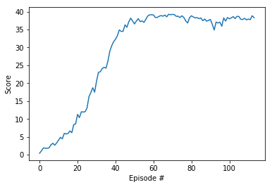

[//]: # (Image References)

<!-- [image1]: https://user-images.githubusercontent.com/10624937/42135619-d90f2f28-7d12-11e8-8823-82b970a54d7e.gif "Trained Agent" -->

# Solution of Project 2: Continuous Control

In this repository, you will find a solution for the second project of the [Deep Reinforcement Learning Nanodegree](https://www.udacity.com/course/deep-reinforcement-learning-nanodegree--nd893). This project involves the use of the Unity ML-Agents environment.

### The Enviroment

We will train an agent to work with the Reacher environment:

In this environment, a double-jointed arm can move to target locations. A reward of +0.1 is provided for each step that the agent's hand is in the goal location. Thus, the goal of your agent is to maintain its position at the target location for as many time steps as possible.

The observation space consists of 33 variables corresponding to position, rotation, velocity, and angular velocities of the arm. Each action is a vector with four numbers, corresponding to torque applicable to two joints. Every entry in the action vector should be a number between -1 and 1.

### Getting Started

1. Download the environment from one of the links below.  You need only select the environment that matches your operating system:
    - Linux: [click here](https://s3-us-west-1.amazonaws.com/udacity-drlnd/P2/Reacher/Reacher_Linux.zip)
    - Mac OSX: [click here](https://s3-us-west-1.amazonaws.com/udacity-drlnd/P2/Reacher/Reacher.app.zip)
    - Windows (32-bit): [click here](https://s3-us-west-1.amazonaws.com/udacity-drlnd/P2/Reacher/Reacher_Windows_x86.zip)
    - Windows (64-bit): [click here](https://s3-us-west-1.amazonaws.com/udacity-drlnd/P2/Reacher/Reacher_Windows_x86_64.zip)
    
    (_For Windows users_) Check out [this link](https://support.microsoft.com/en-us/help/827218/how-to-determine-whether-a-computer-is-running-a-32-bit-version-or-64) if you need help with determining if your computer is running a 32-bit version or 64-bit version of the Windows operating system.

2. Place the file in this GitHub repository and unzip (or decompress) the file. You will find more information in `Continuous_Control.ipynb`.

### Instructions

Run `Continuous_Control.ipynb` to either train a new agent from scratch or evaluate an already trained agent. More information about the agent you find in `Report.md`

### Evaluation

The plot below illustrates the score versus the number of episodes during training for our implemented smart agent (DDPG):

After the training, the agent was evaluated over 100 episodes. It achieved an average score of 38.4.

### Challenge

You are warmly invited to try improving this agent. Experiment with different neural networks, replay buffers, and learning methods. See if you can enhance the performance of the agent. Your contributions would be appreciated!

